# 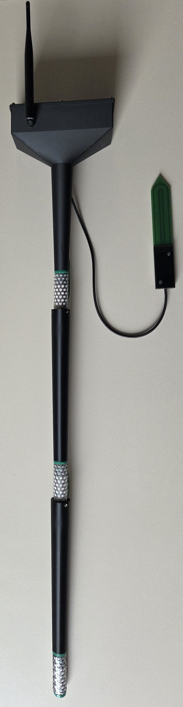

# Componentlist

| Component | Amount | Link | Price |
| :---- | :---- | :---- | :---- |
| PCB | 1 | https://github.com/green-ecolution/Soil-Moisture-Sensor-Node/blob/develop/Hardware/V2/V2\_PCB\_Fusion360\_Design.f3z | \~30€ |
| Heltec LoRa v3 ESP 32 | 1 | https://heltec.org/project/wifi-lora-32-v3/ | \~20€ |
| SMA LoRa 868MHz Antenna | 1 |  | \~1€ |
| SMA to U.FL Cable | 1 |  | \~0.5€ |
| Electronics Case | 1 | https://github.com/green-ecolution/Soil-Moisture-Sensor-Node/blob/develop/Hardware/V2/V2\_case.3mf | \~5€ |
| Lid | 1 | https://github.com/green-ecolution/Soil-Moisture-Sensor-Node/blob/develop/Hardware/V2/V2\_lid.3mf | \~1€ |
| Case to Watermark adapter | 1 | https://github.com/green-ecolution/Soil-Moisture-Sensor-Node/blob/develop/Hardware/V2/V2\_adapte\_watermark\_case.3mf | \~2.5€ |
| Watermark to Watermark spacer | 2 | https://github.com/green-ecolution/Soil-Moisture-Sensor-Node/blob/develop/Hardware/V2/V1\_adapater\_watermark\_watermark.3mf | \~5€ |
| M3 Heat Set Insert | 16 |  | \~0.1€ |
| M3x6 Screws  | 10 |  | \~0.1€ |
| M3 Grub Screws | 6 |  | \~0.1€ |
| Watermark  | 3 | https://www.irrometer.com/pdf/403.pdf | \~183€ |
| SMT 100 | 1 | https://www.truebner.de/de/smt100.php | \~150€ |
| Seal for Lid | 1 |  | \~0.5€ |
| Cable Gland IP68 M16x1.5 | 1 |  | \~1€ |
|  |  |  | \~398.98€ |

# Procurement

## 3d printed parts

All 3D printed parts can be printed in the filament of your choice. Parts should be physically strong to a reasonable degree. It is recommended to use PLA, PETG, ABS or ASA.

## Printed Circuit Board

The PCB should be ordered from a reputable PCB manufacturing service. It is recommended that the assembly service be used. The Fusion 360 electronics project should be used to generate the necessary files to order the PCB.   
The BOM is found here (https://github.com/green-ecolution/Soil-Moisture-Sensor-Node/blob/develop/Hardware/V2/BOM.md)

## Other Components

Can be purchased from any Retailer.

# Assembly

## Step 1: Heat inserts

Insert heat inserts into the following parts at the designated locations.

Watermark to Watermark spacer, 3 inserts at the top of each spacer  
![][Images/heat_inserts_adapter.jpg]

case, 4 inside the case for PCB mounting, 6 on the side walls for the lid.  
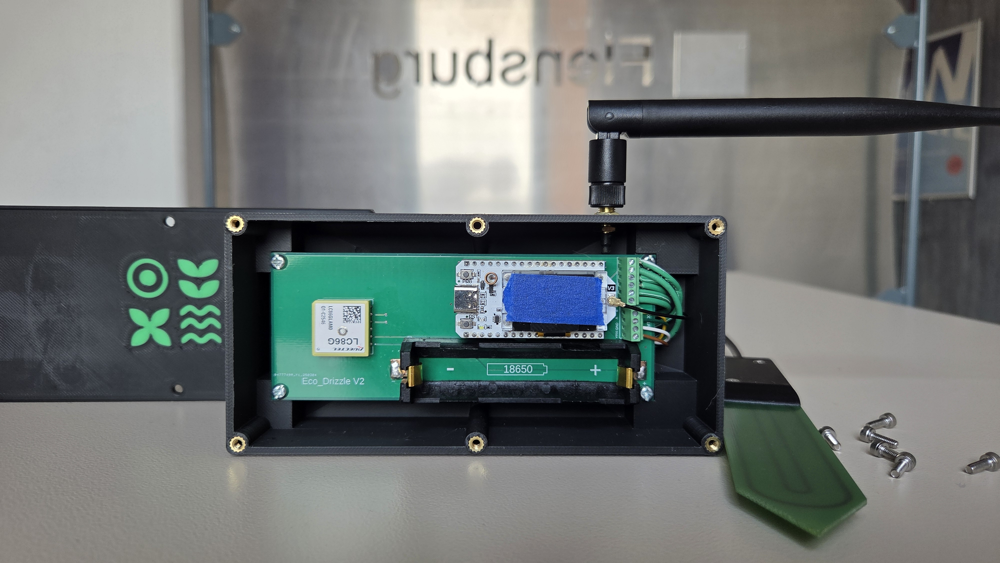

## Step 2: Sensor cable routing

Route watermarks cables through the sensor rod parts and into the case, bypassing the other watermarks via the holes in the spacers. 

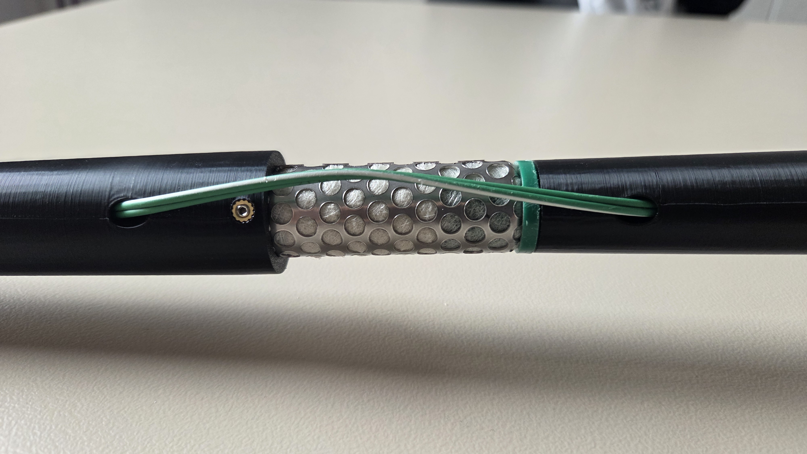

Route SMT-100 cable through the cable outlet of the watermark to case adapter.  

## Step 3: Fixating the sensors

Insert the watermark into the bottom of the adapter. They are secured on the top with set screws.

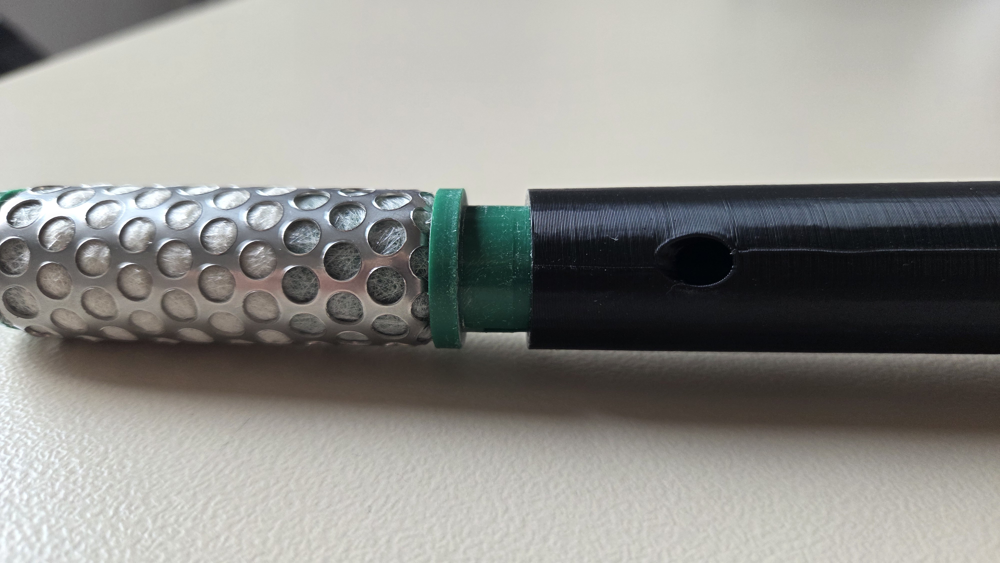

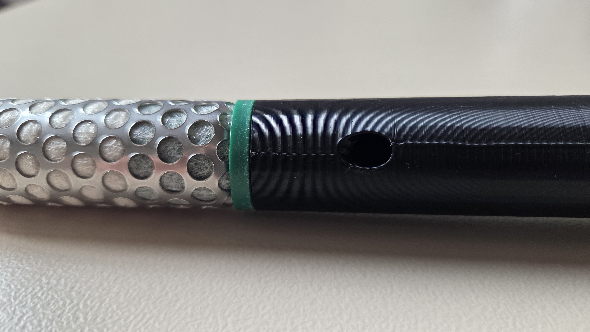

## Step 4: Trimming cables

After routing all cables through the cable gland, fix the cable gland to ensure a watertight seal and cut the cables to reach the terminals on the pcb

## Step 5: Connect cables to PCB

Affix the antenna cable to the side of the housing using the included nuts.  
Connect cables according to markings on the pcb.  
Connect the antenna Cable to the ESP-32

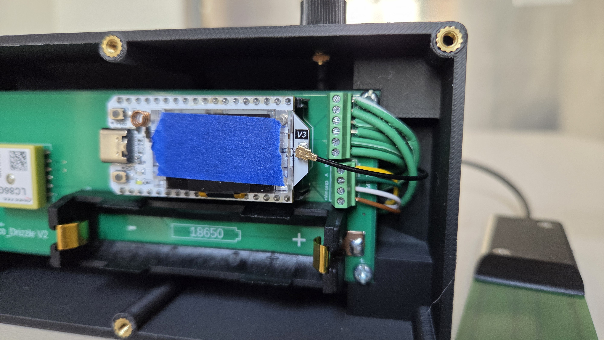

## Step 6: Fasten PCB to case

Insert the 4 screws to fasten the pcb to the case

## Step 7: Attach antenna to case

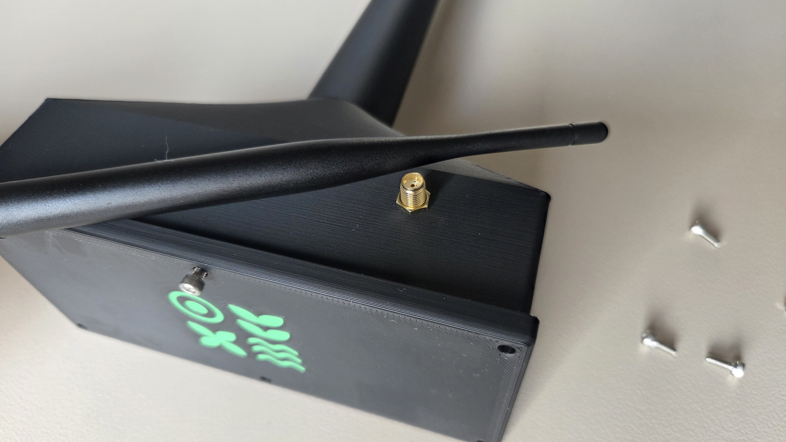
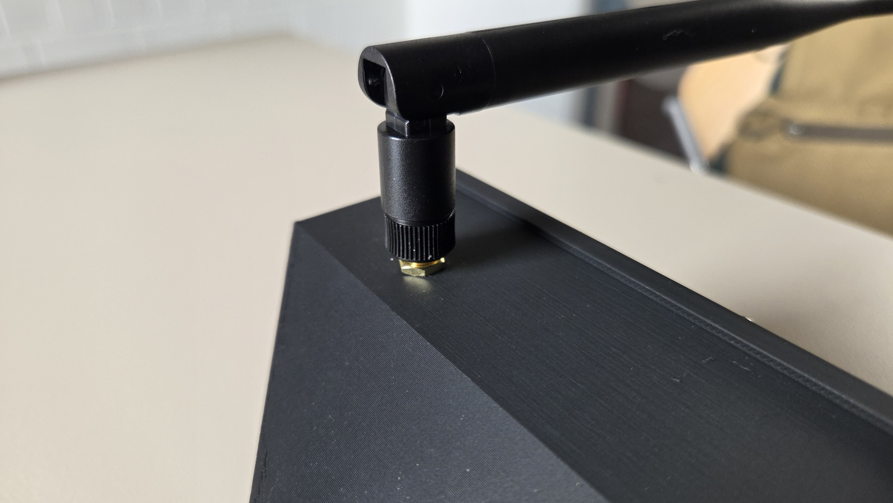

## Step 7: Insert battery

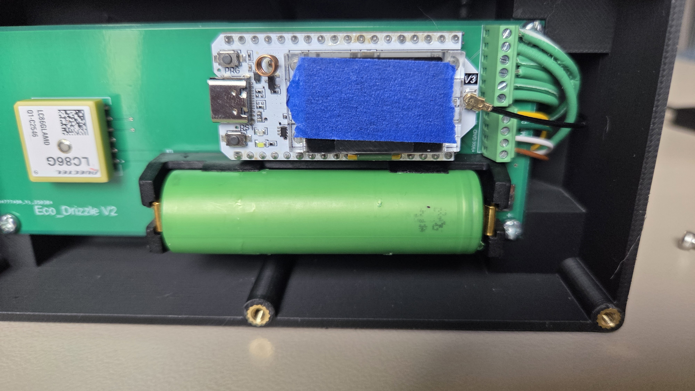

## Step 8: Close lid

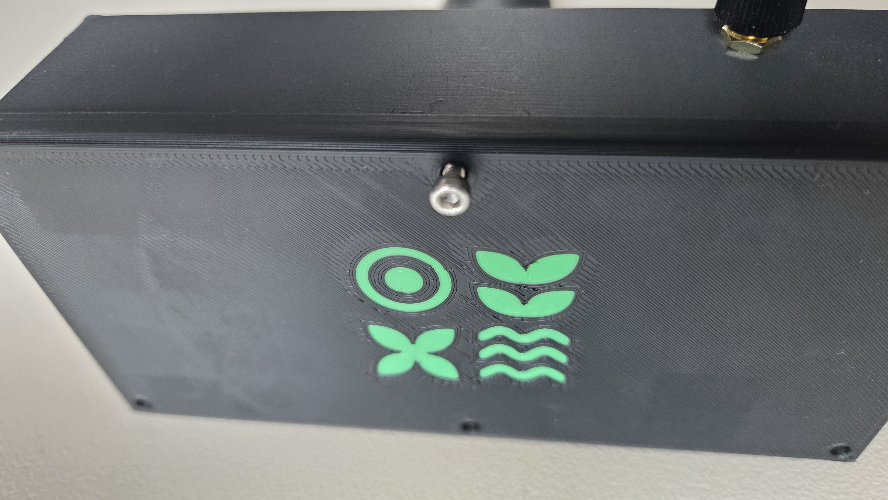

# Flashing the Firmware

Step 1: Open the lid  
Step 2: Connect USB C cable to ESP-32 and computer  
Step 3: Download the flashing software ([https://github.com/green-ecolution/EcoDrizzleFlasher](https://github.com/green-ecolution/EcoDrizzleFlasher))  
Step 4: Open flashing software and login with your account  
Step 5: Give the sensor a name and generate credentials  
Step 6: Click the flash button and wait for completion  
Step 7: Remove cable and close the lid

# Commissioning the Sensor

## Step 1: Use auger to drill \~1 meter deep, 10 cm wide hole. Safe removed ground for later filling the hole.

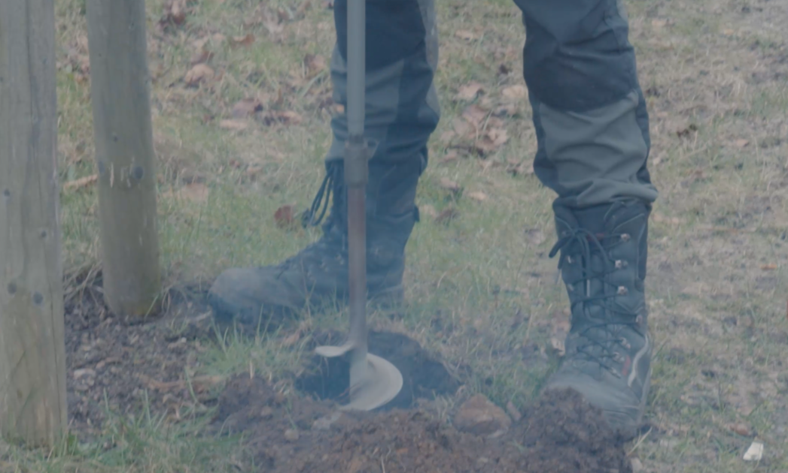

## Step 2: Fully insert sensor node into the hole. Place SMT-100 freely in the hole.

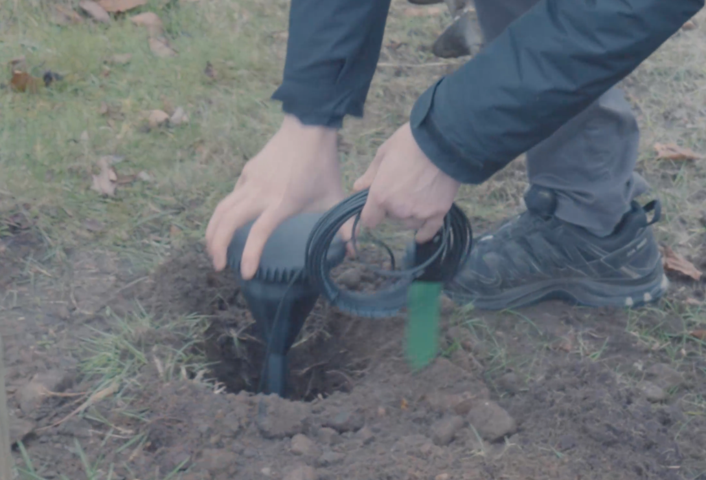

## Step 3: Fill hole with mud slurry mixed from removed ground with water.

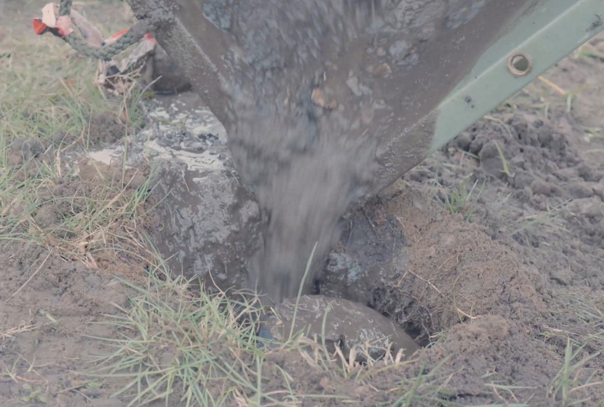