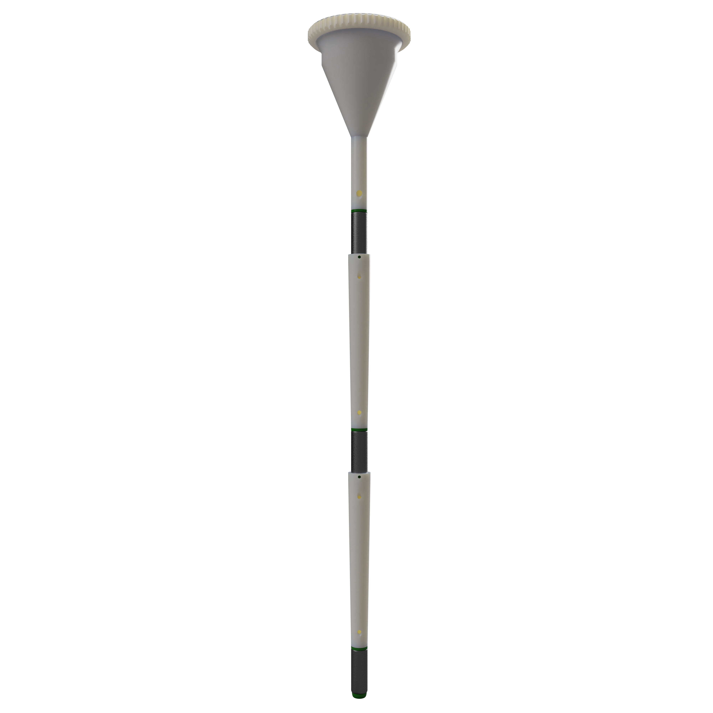
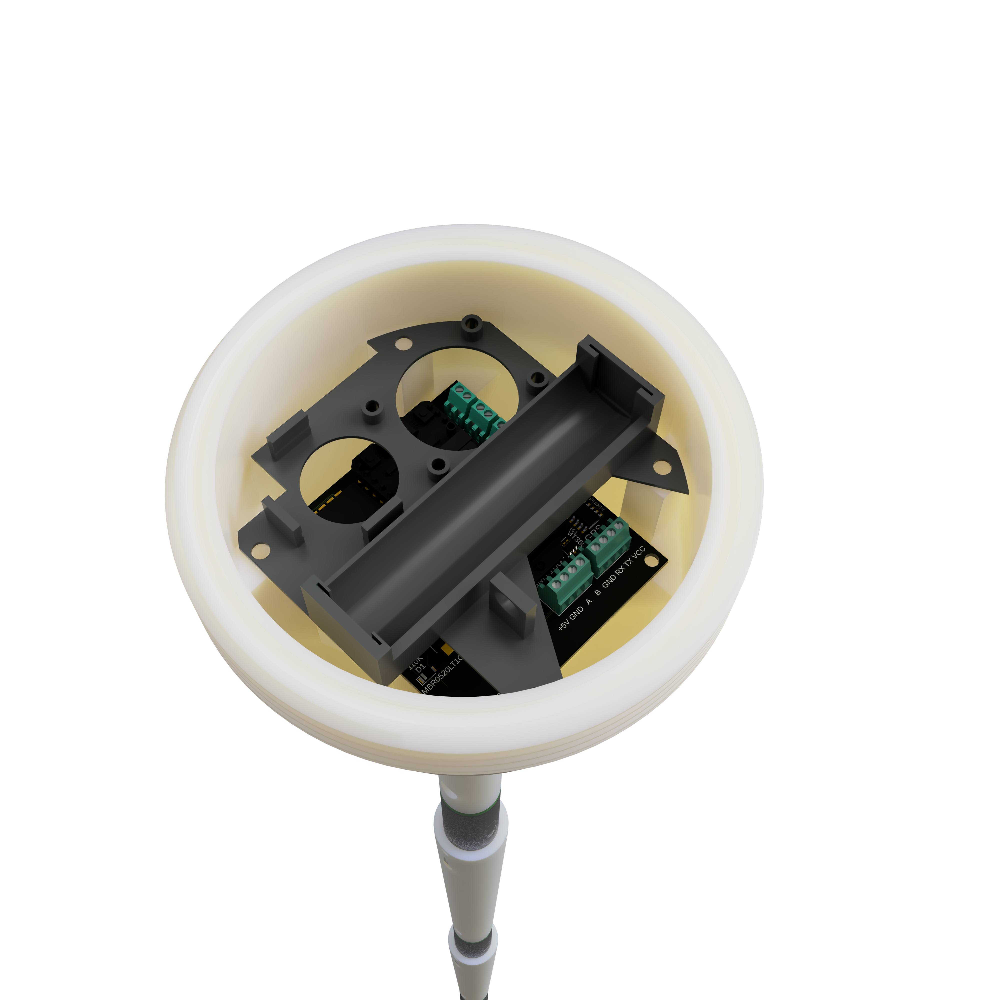
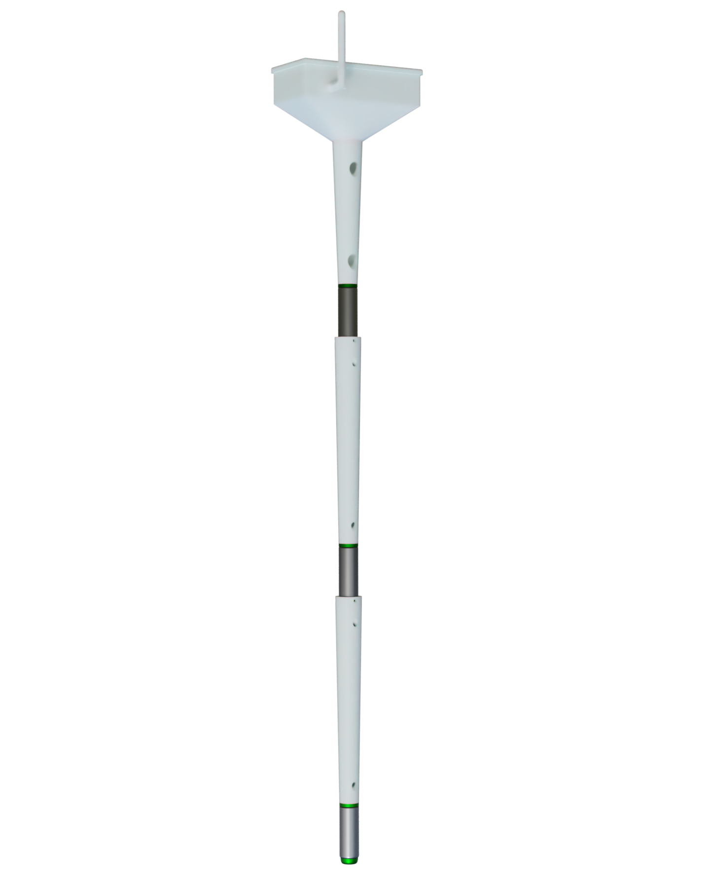
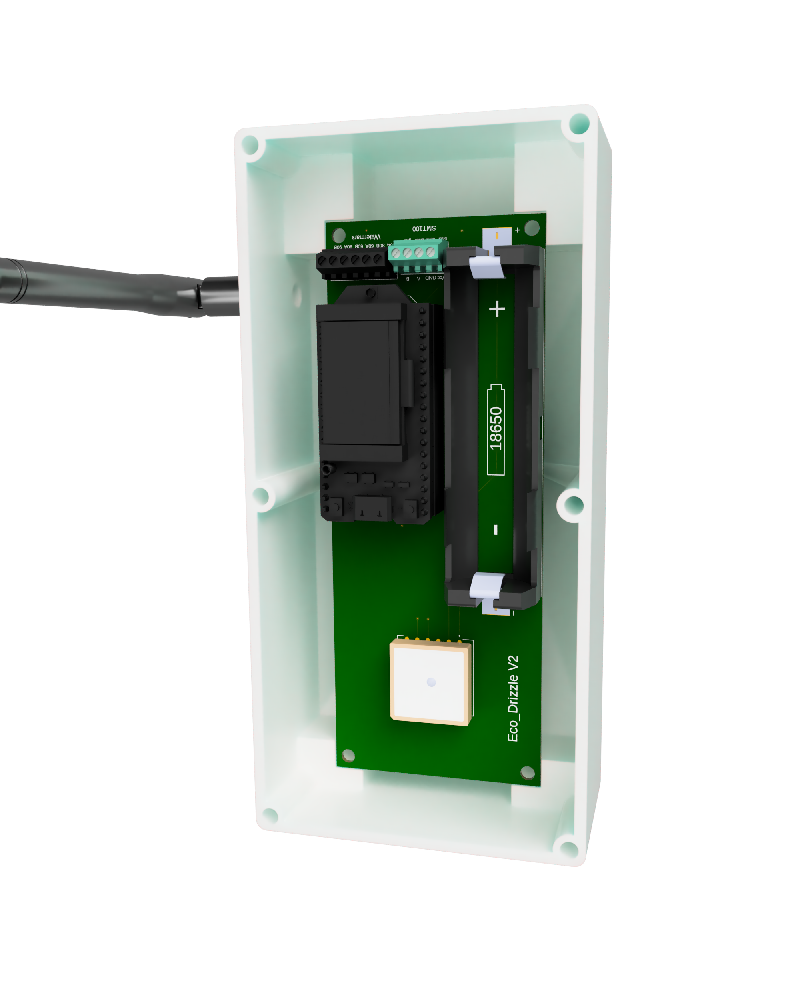

# Soil-Moisture-Sensor-Node
This repository contains the design files, documentation, and firmware for the soil moisture sensor node system, including versions V1 and V2. It also includes the general requirements for a generic sensor node.

## Repository Structure
- **Documentation**: Detailed descriptions of the system, issues, and requirements.
- **Hardware**: Fusion 360 design files and 3MF files for 3D printing.
- **Firmware**: Source code for the microcontroller.
- **Payload-Decoder**: TTN javascript payload decoder for the uplink messages.

## Versions
- **V1**: Initial prototype with documented issues and lessons learned.
  
  
- **V2**: Improved version addressing V1 shortcomings.
  
  
